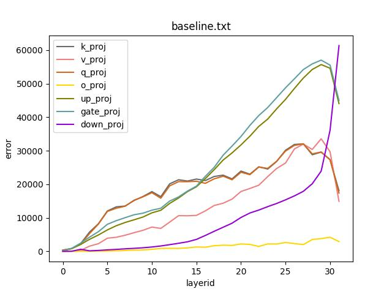
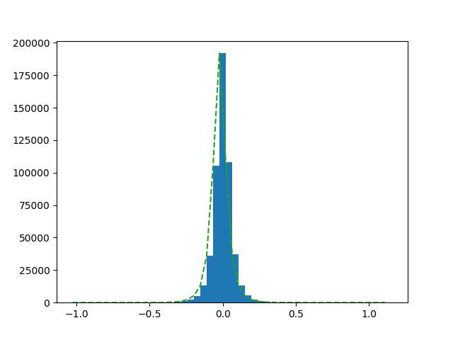
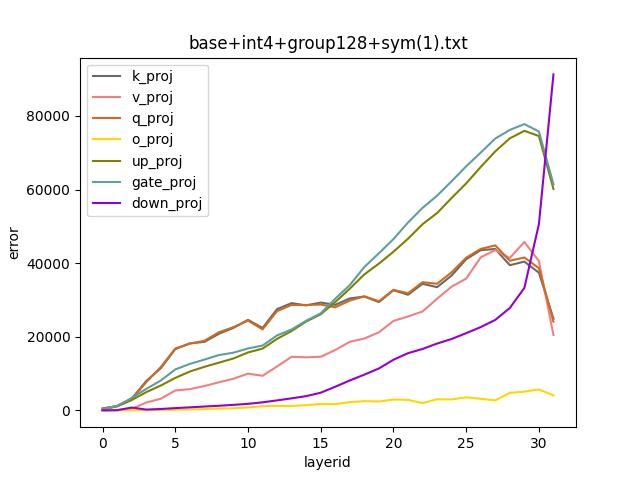
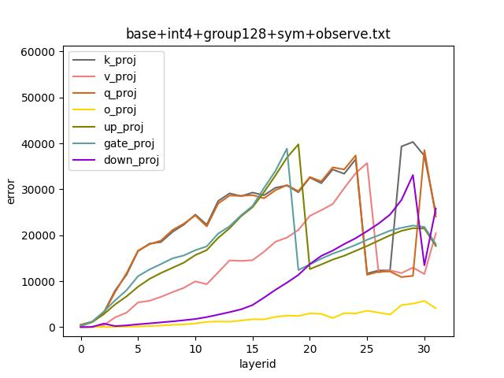

# Remove zero_point in GPTQ-for-LLaMa 

This document aims to remove zero_point in GPTQ-for-LLaMa by error analysis.

First make sure that you already have `--observe` option. AKA [this GPTQ-for-LLaMa PR](https://github.com/qwopqwop200/GPTQ-for-LLaMa/pull/189) merged to your repo.

## Baseline

Let's take a look at baseline quantization error. The log saved in `base+int4+group128.txt`.

```bash
$ cd GPTQ-for-LLaMa
$ python3 llama.py ${MODEL_DIR} c4 --wbits 4 --true-sequential --act-order --groupsize 128 > base+int4+group128.txt
```
Then plot the error for each layer. x-axis means layer_id, y-axis means the error.

```bash
$ cd llama.onnx/tools
$ python3 plot-GPTQ-quant-error.py base+int4+group128.txt
```



We can get 3 hypothesis from this image:

1. after layer15, `MLP` is sensible for quantization 
2. the bigger the layer id, the harder to quantize 
3. quantize `o_proj` is easy

## Remove `zero_point`

GPTQ currently using asymmetric formula [here](https://github.com/qwopqwop200/GPTQ-for-LLaMa/blob/fcf403ffff35b1d28fdb00d0d01f4dbd3fc11c31/quant/quantizer.py#L9)

> q = torch.clamp(torch.round(x / scale) + zero, 0, maxq)

If `zero==0`, it would be faster. Check weight distribution in case of too many outliers.



Weight is symmetric, so we can try symmetric formula.
> q = torch.clamp(torch.round(x / scale), minq, maxq)

Cherry-pick this [PR](https://github.com/tpoisonooo/GPTQ-for-LLaMa/tree/remove-zp), plot and testing.



```bash
..
 ⁇  this is llama and goat meat. This meat has been raised by a small family business and is certified to be organic. The meat is then delivered to a local butcher shop, who takes the meat and makes small batches

```

You can see, error trend not changed while the maximum error arised 50%, from 6e5 to 9e5.

So enable `--observe`, [topk=40](https://github.com/qwopqwop200/GPTQ-for-LLaMa/blob/fcf403ffff35b1d28fdb00d0d01f4dbd3fc11c31/gptq.py#L14) according to former conclusion.



Compare with baseline, we removed zero_point.

| Version | Option | Maxium error | Zero point | Observe
| :-: | :-: | :-: | :-: | :-: |
| baseline | wbit=4,groupsize=128,minq=0,maxq=15 | 6e5 | Y | N |
| observe | wbit=4,groupsize=128/64,minq=-7,maxq=7 | 9e5 | N | N |
| observe | wbit=4,groupsize=128/64,minq=-7,maxq=7 | 4e5 | N | Y |
| observe | wbit=4,groupsize=128/64,minq=-8,maxq=7 | 7e5 | fixed value | N |

About `minq=-8`, you can also use <qmin=-8, qmax=7, zp=0.5*scale> for better precison, check [this branch](https://github.com/tpoisonooo/GPTQ-for-LLaMa/tree/use-fixed-zp) QAQ


## Optimize kernel

Now we can optimze `matmul_248_kernel` [here](https://github.com/qwopqwop200/GPTQ-for-LLaMa/blob/fcf403ffff35b1d28fdb00d0d01f4dbd3fc11c31/quant/quant_linear.py#L34), remove `zeros_ptr`.


>@triton.jit
def matmul_248_kernel(a_ptr, b_ptr, c_ptr, scales_ptr, ~~zeros_ptr~~ ..):

